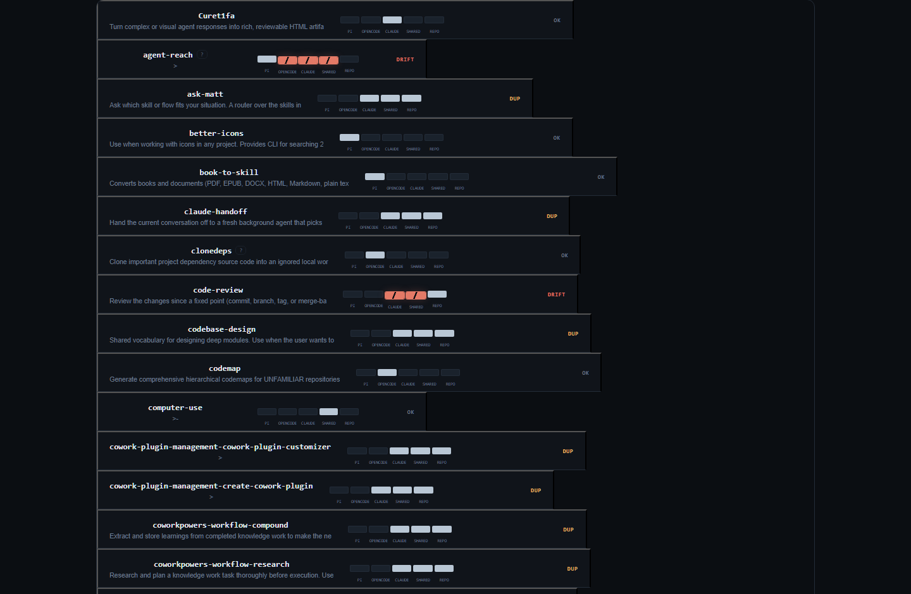
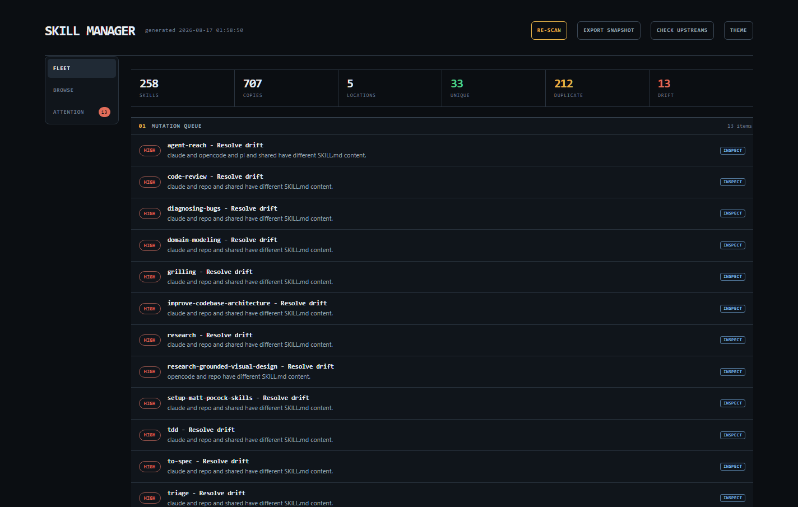
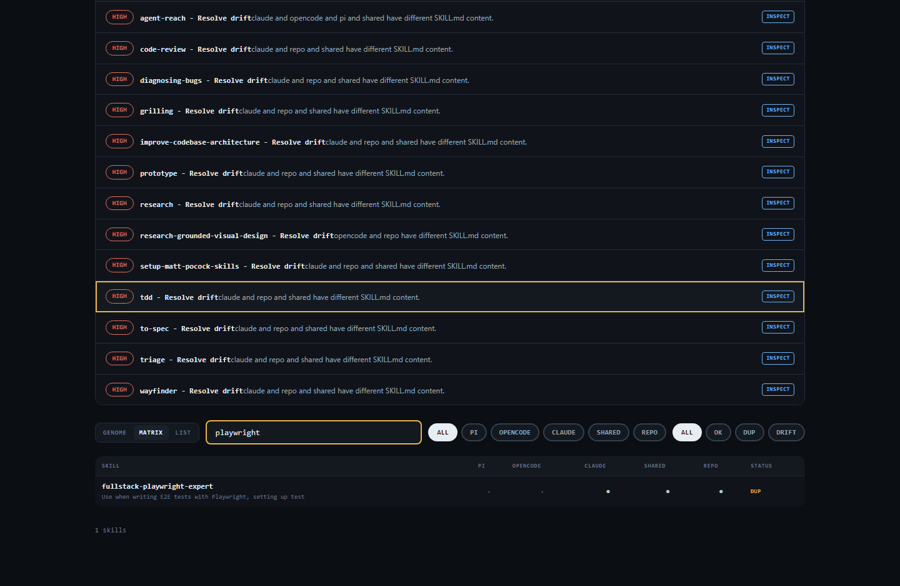
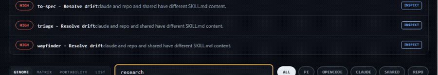
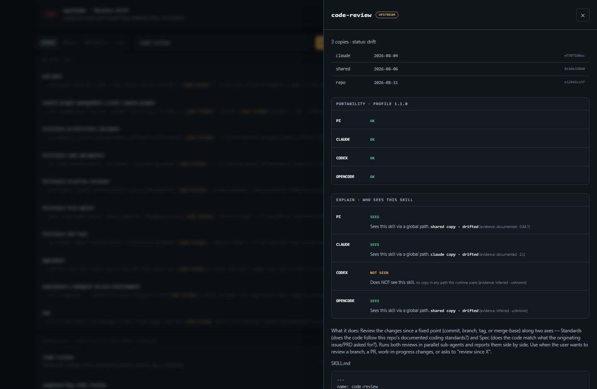
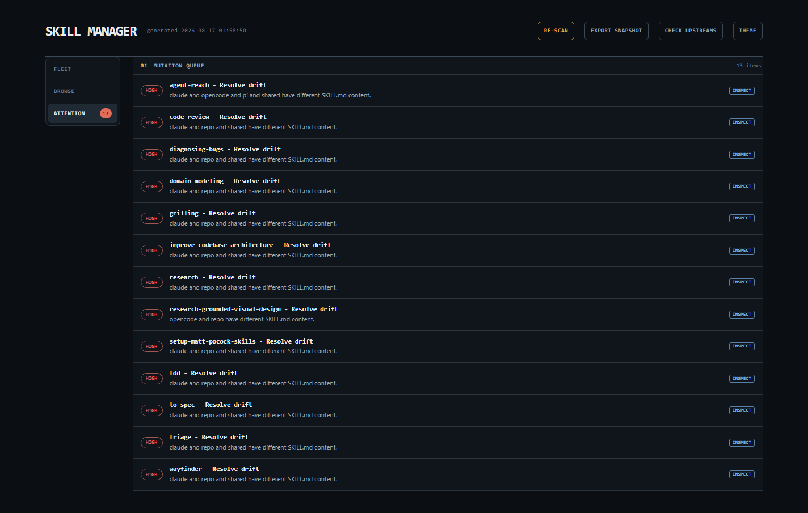
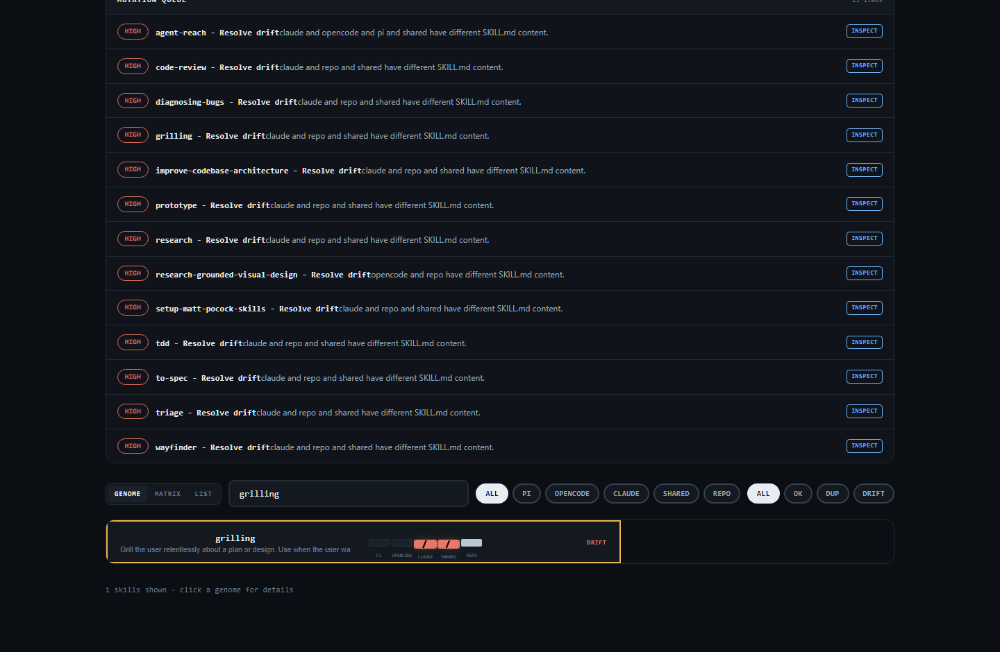

# Skill Manager

> **Evidence and safe change control for a multi-agent skill fleet.**
>
> Skill Manager shows which skills each agent can discover, whether installed copies agree, why a runtime sees a skill, and which changes are safe to make. It is a local evidence instrument for operators running skills across Pi, OpenCode, Claude, and a shared repository.



A skill is a five-location genome: `pi` · `opencode` · `claude` · `shared` · `repo`. When its copies agree, the strip is continuous. When they disagree, it breaks in coral.

## Before and after

| Before | After |
| --- | --- |
| Copies drift across agents and no one notices | The Genome Wall shows every copy and flags where they disagree |
| A runtime cannot find a skill and no one knows why | Explain resolves the discovery path with stated evidence |
| Updating means guessing which copy is canonical | Every change is previewed against the repo source before confirmation |

[Get started](#quick-start) · [Onboarding guide](docs/onboarding.html) · [Releases](https://github.com/intelligentrascal/skill-manager/releases)

---

## OBSERVE

### Genome Wall

The whole fleet as a compact field of five-location genome strips. Identical copies are healthy deployment mirrors. Drift is the signal that deserves attention.

| Status | Meaning |
| --- | --- |
| `OK` | A single copy |
| `MIRROR` | Multiple identical copies |
| `DRIFT` | Copies with the same name differ |
| `VARIANT` | A metadata-backed state for a registered adaptation. The scanner does not emit variant metadata yet, so a deployed variant currently appears as drift |

The repository copy also receives a `repoClean` check against `git HEAD`.

### Matrix and List

Switch between a dense skill-by-location matrix and list rows that carry a compact genome strip. See healthy, absent, and mutated copies without losing the fleet view.



### Full-text search

Search `SKILL.md` bodies, not merely names. Find the skill that mentions a tool, workflow, or phrase and jump to the matching text.



### Watch

When a skill copy changes on disk, the inventory re-scans and the affected strip settles into its new state. Live updates arrive over a local event stream, with a polling fallback where the filesystem refuses watching.



## EXPLAIN

### Portability

See what Pi, Claude, Codex, and OpenCode actually do with a skill's frontmatter. Findings are labeled documented or inferred, and unknown fields are surfaced rather than declared broken.


### Explain

Ask the useful question directly: why does agent X see skill Y? Per-agent answers resolve the discovery path, measure integrity against the repo copy, and give the honest negative case - with confidence stated where precedence is not documented.



### Provenance

Every skill knows where it came from. A committed `skillmgr.yaml` records provenance (upstream / mine / promoted / upstream-edited), the canonical upstream URL and subpath, and a pinned revision. Frontmatter is only a suggested import - the manifest is the authority.

## CHANGE SAFELY

### Review queue

Drifted skills and uncommitted repo copies surface in a focused queue. Inspect the change before acting - the queue never applies anything on its own.



### Sync preview and confirmation

Sync flows are previewed before confirmation. You see the exact source and target copies, then choose which targets to overwrite. A target is written only after its current hash still matches the preview.



### Manifest-pinned upstream updates

A skill that declares a pinned upstream identity in `skillmgr.yaml` (URL, subpath, and revision) can be previewed at that revision. The preview is read-only and mirror-gated: it reports whether the baseline is the repo mirror and marks apply as available only when it is. Apply and rollback exist in the update service but are not yet exposed in the dashboard - only the preview is surfaced today. When executable behavior changes, the service requires a typed acknowledgement.

### Variants with verification

A claude-only skill becomes usable on pi, opencode, or codex as a linked variant: adapted per agent (claude invocation fields removed, opencode triggers added, and anything that does not carry over is reported rather than dropped), stored as a full snapshot, and deployed explicitly. The deployed copy is then re-verified; a failure is reported, and the deployment must not be treated as accepted - it is not rolled back automatically.

## QUICK START

```bash
git clone https://github.com/intelligentrascal/skill-manager.git
cd skill-manager
npm install
npm run serve
```

Open [http://127.0.0.1:7788](http://127.0.0.1:7788). No account, cloud service, or build step.

## DISCOVERY LOCATIONS

Skill Manager scans the standard Pi, OpenCode, Claude, shared, and repository locations, parses each `SKILL.md`, hashes the full file, and groups copies by skill name.

| Location | Default path | Layout |
| --- | --- | --- |
| `pi` | `~/.pi/agent/skills` | flat |
| `opencode` | `~/.config/opencode/skills` | flat |
| `claude` | `~/.claude/skills` | flat, often symlinked |
| `shared` | `~/.agents/skills` | flat |
| `repo` | `<your-agent-skills-repo>/skills` | nested by category |

Override paths with `SM_PI_SKILLS`, `SM_OPENCODE_SKILLS`, `SM_CLAUDE_SKILLS`, `SM_SHARED_SKILLS`, and `SM_REPO_SKILLS`. Set `SM_PORT` to change the default port, `7788`.

## SAFETY MODEL

- **Preview before confirmation.** Sync is previewed and requires explicit target confirmation before any copy is written. Upstream updates are preview-only in the dashboard; no apply is exposed.
- **The repo is the source of truth.** Drift resolution starts from the repository copy, which is reviewable before a target changes.
- **Manifest-pinned identity.** Upstream updates follow the identity pinned in `skillmgr.yaml` (URL, subpath, and revision). Nothing guesses from HEAD.
- **Variant verification.** A deployed variant is re-checked against the copy the target reads. Failures are reported - a failing deployment is not removed and must not be treated as accepted.
- **Local-only binding.** The dashboard runs on `127.0.0.1` using Node built-ins only. No account, no cloud service.

## LIMITS

- **Runtime facts are labeled, not guessed.** Each compatibility and discovery finding is documented, inferred, or unknown. Pi and Claude profiles are documented; Codex and OpenCode profiles are inferred until runtime probes verify them.
- **No absent repo mirror is represented as apply-capable.** The update preview marks apply as available only when the baseline is the repo mirror; an installed copy is never presented as the mirror. Apply and rollback are not yet exposed in the dashboard at all.
- **No universal compatibility claim.** Skill Manager reports what it can prove and labels the rest. It does not claim that every frontmatter field works in every runtime.

## LINKS

- [Onboarding guide](docs/onboarding.html)
- [Latest releases](https://github.com/intelligentrascal/skill-manager/releases)
- [Build specification](BUILD-SPEC.md)

## LICENSE

MIT
